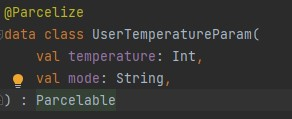
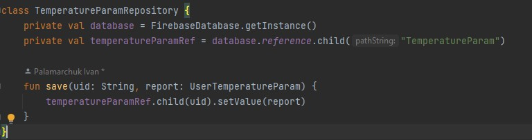
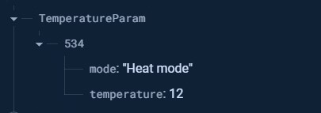

 
Рисунок 1 - Фрагмент екрану IDE Android Studio з конструюванням моделі UserTemperatureParam  
 
Рисунок 2 - Фрагмент екрану IDE Android Studio з конструюванням репозиторію для взаємодії з моделю UserTemperatureParam  
 
Рисунок 3 - Фрагмент екрану Firebase Database з даними моделі UserTemperatureParam
